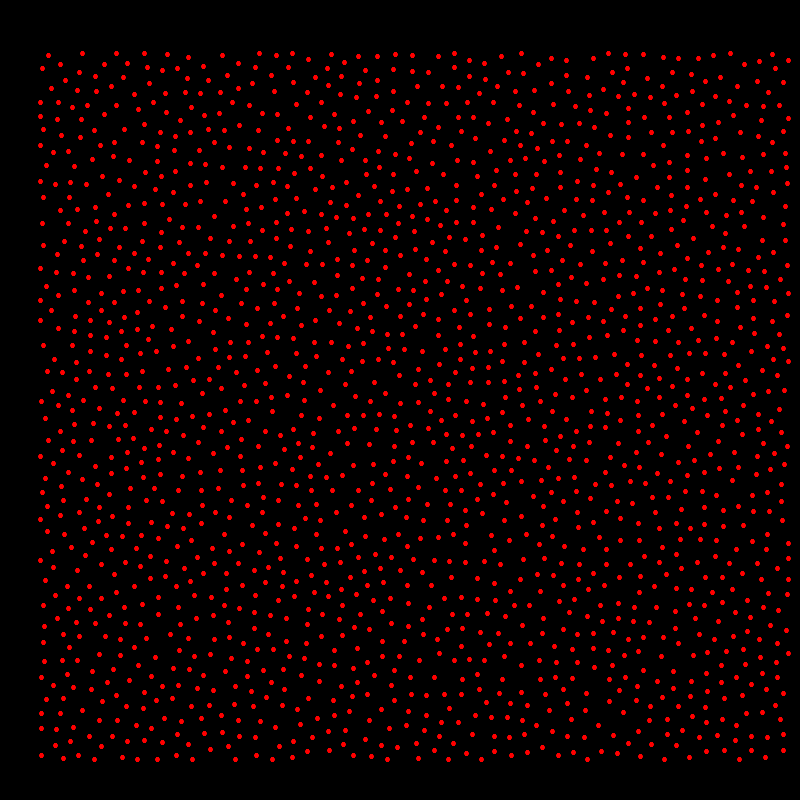
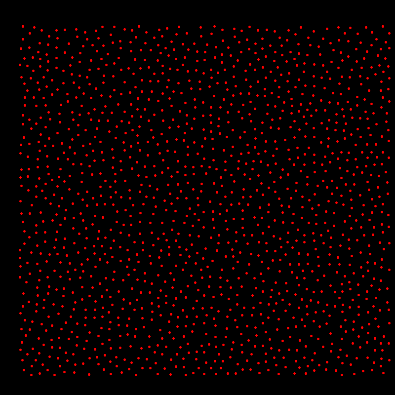
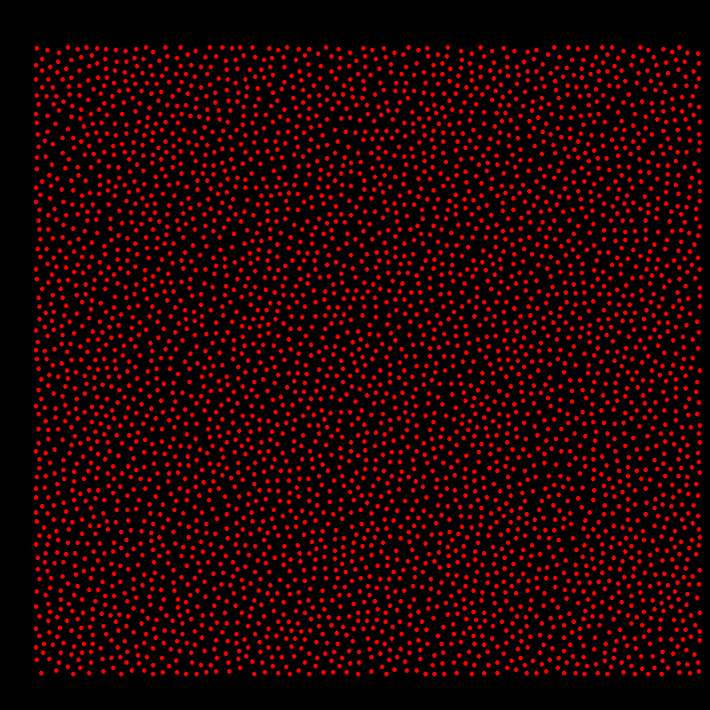

# Poisson-Sampling

This repository contains an implementation of the Poisson Disk Sampling algorithm in Rust. The algorithm generates a
set of points that are evenly distributed within a specified area, ensuring that no two points are closer than a given
minimum distance (radius). This technique is commonly used in computer graphics, procedural generation, and spatial
sampling.

## Brute force Plot Samples

- Points: 1803
- Radius: 100
- Area: 5000 x 5000

- Points: 1500
- Radius: 100
- Area: 5000 x 5000

- Points: 4007
- Radius: 100
- Area: 7500 x 7500

